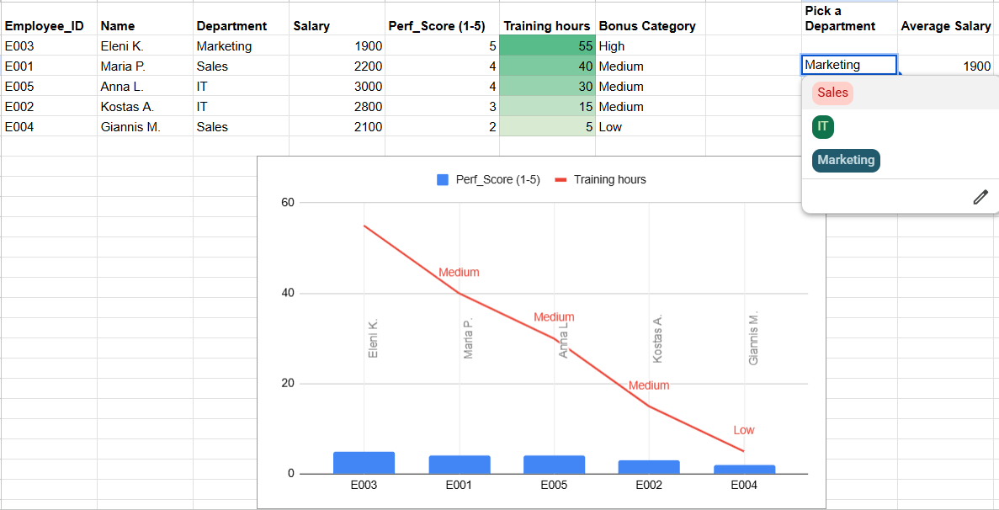

# Employee Performance & Training Impact Analysis

## Επισκόπηση Project
Αυτό το project αναλύει τα δεδομένα του ανθρώπινου δυναμικού μιας εταιρείας για να εντοπίσει τη σχέση μεταξύ της εκπαίδευσης (Training) και της απόδοσης (Performance) των εργαζομένων. 

## Τεχνικές & Συναρτήσεις
* **VLOOKUP / XLOOKUP:** Σύνδεση διαφορετικών πινάκων δεδομένων (Employee Info + Training Logs).
* **Logical Functions (IFS):** Αυτόματη κατηγοριοποίηση υπαλλήλων σε "Bonus Categories" βάσει του Perf_Score.
* **Dynamic Analysis (AVERAGEIF + Dropdowns):** Δημιουργία δυναμικού εργαλείου για τον υπολογισμό του μέσου μισθού ανά τμήμα.
* **Conditional Formatting:** Οπτική επισήμανση υπαλλήλων με ελλιπή εκπαίδευση (<10 ώρες).
* **Data Visualization:** Δημιουργία Bar Charts για τη σύγκριση δεδομένων μεταξύ των τμημάτων.

## Συμπεράσματα (Insights)
* Εντοπίστηκαν υπάλληλοι με υψηλή απόδοση (Score 5) που απαιτούν επιβράβευση.
* Η χρήση της `AVERAGEIF` έδειξε ποιο τμήμα έχει το υψηλότερο μισθολογικό κόστος.
* Τα Bar Charts ανέδειξαν τα τμήματα που επενδύουν περισσότερο χρόνο στην εκπαίδευση.

## Αρχεία
* `Employee_Performance_Analysis.xlsx`: Το πλήρες αρχείο δεδομένων.

## Screenshots

